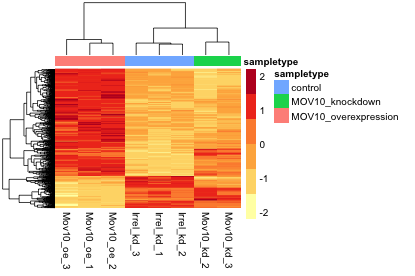

## Learning Objectives 

* Describe common plots for visualizing results of a DGE analysis

## Visualizing the results of a DGE experiment

### Plotting signicantly differentially expressed genes

One way to visualize results would be to simply plot the expression data for a handful of genes across the various sample groups. 

This can be implemented in R (usually) for **multiple genes** of interest or a **single gene** using functions associated with 
* the package used to perform the statistical analysis (e.g. DESeq2's `plotCounts()` function) or 
* an external package created for this purpose (e.g. pheatmap, [DEGreport](https://bioconductor.org/packages/release/bioc/html/DEGreport.html)) or
* using the `ggplot2` package.

#### Plotting expression of a single gene across sample groups:


#### Plotting expression of multiple genes across sample groups :

One way to visualize results would be to simply plot the expression data for a handful of genes across the various sample groups. 

The plot below displays the top 20 significantly differentially expressed genes. Please note that the normalized counts on the Y axis are logged (log10) to ensure that the any large differences in expression are plotted without compromising the quality of the visualization.


### Heatmap

In addition to plotting subsets, we could also extract the normalized values of *all* the significant genes and plot a heatmap of their expression using `pheatmap()`.
         
       

In this heatmap Z-scores are calculated for each row (each gene) and these are plotted instead of the normalized expression values; this ensures that the expression patterns/trends that we want to visualize are not overwhelmed by the expression values.

> *Z-scores are computed on a gene-by-gene basis by subtracting the mean and then dividing by the standard deviation. The Z-scores are computed **after the clustering**, so that it only affects the graphical aesthetics and the color visualization is improved.*

### Volcano plot

The above plot would be great to look at the expression levels of a good number of genes, but for more of a global view there are other plots we can draw. A commonly used one is a volcano plot; in which you have the log transformed adjusted p-values plotted on the y-axis and log2 fold change values on the x-axis. 

To generate a volcano plot, we first need to have a column in our results data indicating whether or not the gene is considered differentially expressed based on p-adjusted values.

```r
## Obtain logical vector regarding whether padj values are less than 0.05 and fold change greater than 1.5 in either direction
res_tableOE_tb <- res_tableOE_tb %>% mutate(threshold_OE = padj < 0.05 & abs(log2FoldChange) >= 0.58)
```

Now we can start plotting. The `geom_point` object is most applicable, as this is essentially a scatter plot:

```r
## Volcano plot
ggplot(res_tableOE_tb) +
        geom_point(aes(x = log2FoldChange, y = -log10(padj), colour = threshold_OE)) +
        ggtitle("Mov10 overexpression") +
        xlab("log2 fold change") + 
        ylab("-log10 adjusted p-value") +
        #scale_y_continuous(limits = c(0,50)) +
        theme(legend.position = "none",
              plot.title = element_text(size = rel(1.5), hjust = 0.5),
              axis.title = element_text(size = rel(1.25)))  
```

 

This is a great way to get an overall picture of what is going on, but what if we also wanted to know where the top 10 genes (lowest padj) in our DE list are located on this plot? We could label those dots with the gene name on the Volcano plot using `geom_text_repel()`.

To make this work we have to take the following 3 steps:

(Step 1) Create a new data frame sorted or ordered by padj

(Step 2) Indicate in the data frame which genes we want to label by adding a logical vector to it, wherein "TRUE" = genes we want to label.
 
```r
## Create a column to indicate which genes to label
res_tableOE_tb <- res_tableOE_tb %>% arrange(padj) %>% mutate(genelabels = "")

res_tableOE_tb$genelabels[1:10] <- res_tableOE_tb$gene[1:10]

View(res_tableOE_tb)
```

(Step 3) Finally, we need to add the `geom_text_repel()` layer to the ggplot code we used before, and let it know which genes we want labelled. 

```r
ggplot(res_tableOE_tb) +
        geom_point(aes(x = log2FoldChange, 
                       y = -log10(padj),
                       colour = threshold_OE)) +
        geom_text_repel(aes(x = log2FoldChange, 
                            y = -log10(padj), 
                            label = genelabels)) +
        ggtitle("Mov10 overexpression") +
        xlab("log2 fold change") + 
        ylab("-log10 adjusted p-value") +
        theme(legend.position = "none",
              plot.title = element_text(size = rel(1.5), hjust = 0.5),
              axis.title = element_text(size = rel(1.25))) 
```

 

***

> ***NOTE:** If using the DESeq2 tool for differential expression analysis, the package 'DEGreport' can use the DESeq2 results output to make the top20 genes and the volcano plots generated above by writing a few lines of simple code. While you can customize the plots above, you may be interested in using the easier code. Below are examples of the code to create these plots:*

> ```r
> DEGreport::degPlot(dds = dds, res = res, n = 20, xs = "type", group = "condition") # dds object is output from DESeq2
> 
> DEGreport::degVolcano(
>     as.data.frame(res[,c("log2FoldChange","padj")]), # table - 2 columns
>     plot_text = as.data.frame(res[1:10,c("log2FoldChange","padj","id")])) # table to add names
>     
> # Available in the newer version for R 3.4
> DEGreport::degPlotWide(dds = dds, genes = row.names(res)[1:5], group = "condition")
> ```
***

*This lesson has been developed by members of the teaching team at the [Harvard Chan Bioinformatics Core (HBC)](http://bioinformatics.sph.harvard.edu/). These are open access materials distributed under the terms of the [Creative Commons Attribution license](https://creativecommons.org/licenses/by/4.0/) (CC BY 4.0), which permits unrestricted use, distribution, and reproduction in any medium, provided the original author and source are credited.*

* *Materials and hands-on activities were adapted from [RNA-seq workflow](http://www.bioconductor.org/help/workflows/rnaseqGene/#de) on the Bioconductor website*
